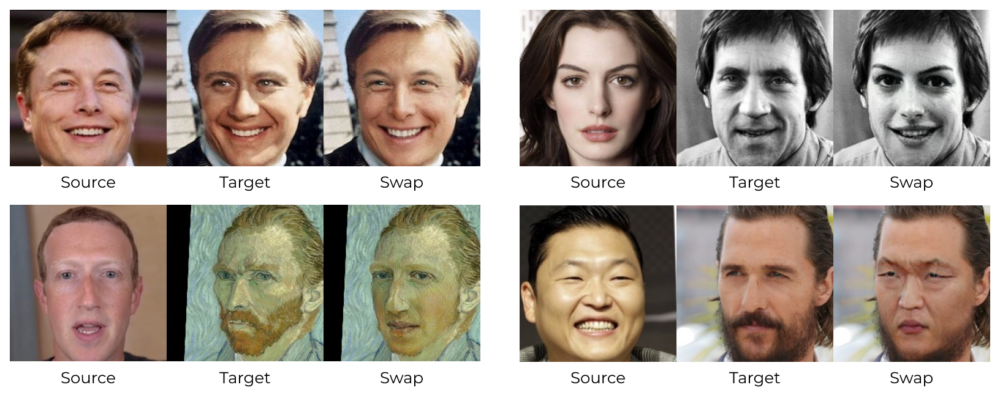
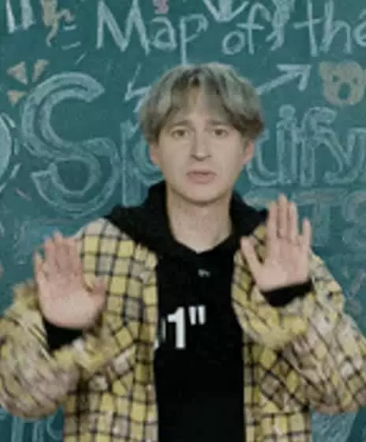

[[Paper](https://ieeexplore.ieee.org/stamp/stamp.jsp?tp=&arnumber=9851423)] [[Habr](https://habr.com/ru/company/sberbank/blog/645919/)]

# 👻 GHOST: Generative High-fidelity One Shot Transfer 

Our paper ["GHOST—A New Face Swap Approach for Image and Video Domains"](https://ieeexplore.ieee.org/abstract/document/9851423) has been published on IEEE Xplore.

<p align="left">
  Google Colab Demo
</p>
<p align="left">
  <a href="https://colab.research.google.com/drive/1B-2JoRxZZwrY2eK_E7TB5VYcae3EjQ1f">
  
  </a>
</p>

## GHOST Ethics 

> Deepfake stands for a face swapping algorithm where the source and target can be an image or a video. Researchers have investigated sophisticated generative adversarial networks (GAN), autoencoders, and other approaches to establish precise and robust algorithms for face swapping. However, the achieved results are far from perfect in terms of human and visual evaluation. In this study, we propose a new one-shot pipeline for image-to-image and image-to-video face swap solutions - GHOST (Generative High-fidelity One Shot Transfer).

Deepfake是一种人脸交换算法，源和目标可以是图像或视频。研究人员研究了复杂的生成对抗网络(GAN)、自动编码器和其他方法，以建立精确和健壮的人脸交换算法。然而，所取得的结果在人与视觉评价方面还远远不够完善。在这项研究中，我们提出了一种新的一次性管道，用于图像到图像和图像到视频的人脸交换解决方案- GHOST（生成高保真的一个镜头转移）

> Deep fake synthesis methods have been improved a lot in quality in recent years. The research solutions were wrapped in easy-to-use API, software and different plugins for people with a little technical knowledge. As a result, almost anyone is able to make a deepfake image or video by just doing a short list of simple operations. At the same time, a lot of people with malicious intent are able to use this technology in order to produce harmful content. High distribution of such a content over the web leads to caution, disfavor and other negative feedback to deepfake synthesis or face swap research.

近年来，深度假体合成方法在质量上有了很大的改进。研究解决方案包装在易于使用的API、软件和不同的插件中，适合有一点技术知识的人。因此，几乎任何人都可以通过做一些简单的操作来制作deepfake图像或视频。与此同时，许多怀有恶意的人能够利用这项技术来制作有害的内容。这种内容在网络上的大量传播导致了对深度造假合成或换脸研究的谨慎、不喜欢和其他负面反馈

> As a group of researchers, we are not trying to denigrate celebrities and statesmen or to demean anyone. We are computer vision researchers, we are engineers, we are activists, we are hobbyists, we are human beings. To this end, we feel that it's time to come out with a standard statement of what this technology is and isn't as far as us researchers are concerned.

作为一组研究人员，我们并不是要诋毁名人和政治家，也不是要贬低任何人。我们是计算机视觉研究人员，我们是工程师，我们是活动家，我们是业余爱好者，我们是人类。为此，我们觉得是时候提出一个标准的声明，说明这项技术是什么，就我们研究人员而言不是什么。

* GHOST不用于创建不适当的内容。GHOST is not for creating inappropriate content.
* GHOST不允许在未经同意的情况下更换面孔，也不允许隐藏其用途。GHOST is not for changing faces without consent or with the intent of hiding its use.
* GHOST不用于任何非法、不道德或可疑的目的。GHOST is not for any illicit, unethical, or questionable purposes.
* GHOST的存在是为了实验和发现人工智能技术，用于社会或政治评论，用于电影，以及任何道德和合理的用途。GHOST exists to experiment and discover AI techniques, for social or political commentary, for movies, and for any number of ethical and reasonable uses.

> We are very troubled by the fact that GHOST can be used for unethical and disreputable things. However, we support the development of tools and techniques that can be used ethically as well as provide education and experience in AI for anyone who wants to learn it hands-on. Now and further, we take a **zero-tolerance approach** and **total disregard** to anyone using this software for any unethical purposes and will actively discourage any such uses.

我们对GHOST可能被用于不道德和不光彩的事情感到非常困扰。但是，我们支持开发可以在道德上使用的工具和技术，并为任何想要动手学习人工智能的人提供人工智能方面的教育和经验。现在和以后，我们采取**零容忍的方法**和**完全无视**任何人使用本软件出于任何不道德的目的，并将积极阻止任何此类使用


## Image Swap Results 



## Video Swap Results
<div>




<div/>


## Installation

1. 克隆这个存储库 Clone this repository
  ```bash
  git clone https://github.com/sberbank-ai/sber-swap.git
  cd sber-swap
  git submodule init
  git submodule update
  ```
2. 安装依赖包 Install dependent packages
  ```bash
  pip install -r requirements.txt
  ```
  ```
  numpy
  -f https://download.pytorch.org/whl/torch_stable.html
  torch==1.6.0+cu101
  -f https://download.pytorch.org/whl/torch_stable.html
  torchvision==0.7.0+cu101
  opencv-python
  onnx==1.9.0
  onnxruntime-gpu==1.4.0
  mxnet-cu101mkl
  scikit-image
  insightface==0.2.1
  requests==2.25.1
  kornia==0.5.4
  dill
  wandb
  ```
  
  > If it is not possible to install onnxruntime-gpu, try onnxruntime instead  
  
  如果无法安装onnxruntime-gpu，请尝试安装onnxruntime
  
3. 下载权重 Download weights
  ```bash
  sh download_models.sh
  ```
## Usage
  1. Colab Demo or you can use jupyter notebook [SberSwapInference.ipynb](SberSwapInference.ipynb) locally
  2. 视频换脸 Face Swap On Video

>  Swap to one specific person in the video. You must set face from the target video (for example, crop from any frame).

切换到视频中的一个人。你必须从目标视频设置面(例如，从任何帧裁剪)。

  ```bash
  python inference.py --source_paths {PATH_TO_IMAGE} --target_faces_paths {PATH_TO_IMAGE} --target_video {PATH_TO_VIDEO}
  ```
> Swap to many person in the video. You must set multiple faces for source and the corresponding multiple faces from the target video.

交换到视频中的许多人。必须为源视频设置多个人脸，并从目标视频中设置相应的多个人脸。

  ```bash
  python inference.py 
  --source_paths {PATH_TO_IMAGE PATH_TO_IMAGE ...} 
  --target_faces_paths {PATH_TO_IMAGE PATH_TO_IMAGE ...} --target_video {PATH_TO_VIDEO}
  ```
  3. 图片换脸 Face Swap On Image

> You may set the target face, and then source will be swapped on this person, or you may skip this parameter, and then source will be swapped on any person in the image.

你可以设置目标人脸，然后在这个人身上交换源，或者你可以跳过这个参数，然后在图像中的任何一个人身上交换源。

  ```bash
  python inference.py --target_path {PATH_TO_IMAGE} --image_to_image True
  ```

## Training

> We also provide the training code for face swap model as follows:

我们还提供换脸模型的训练代码如下:

  1. Download [VGGFace2 Dataset](https://www.robots.ox.ac.uk/~vgg/data/vgg_face/).
  2. 用外检测模型裁剪和对齐人脸。 Crop and align faces with out detection model.
  ```bash
  python preprocess_vgg.py --path_to_dataset {PATH_TO_DATASET} --save_path {SAVE_PATH}
  ```
  3. Start training. 
  ```bash
  python train.py --run_name {YOUR_RUN_NAME}
  ```
> We provide a lot of different options for the training. More info about each option you can find in `train.py` file. If you would like to use wandb logging of the experiments, you should login to wandb first  `--wandb login`.

我们为训练提供了很多不同的选择。关于每个选项的更多信息，您可以在 `train.py` 。如果你想用wandb记录实验，您应该首先登录到wandb  `--wandb login`.

### Tips
    1. 对于第一个epoch，我们建议不要使用眼睛检测损失和调度器，如果你从头开始训练。 For the first epochs we suggest not to use eye detection loss and scheduler if you train from scratch.
    2. 在进行微调的情况下，您可以变量损失系数，使输出看起来与源身份相似，反之亦然，以保存目标面部的特征和属性。In case of finetuning you can variate losses coefficients to make the output look similar to the source identity, or vice versa, to save features and attributes of target face.
    3. 您可以使用参数更改属性编码器的主干和AAD ResBlk的num_blocks。You can change the backbone of the attribute encoder and num_blocks of AAD ResBlk using parameters `--backbone` and `--num_blocks`.
    4. 在微调阶段，您可以使用位于“weights”文件夹中的生成器和鉴别器的预训练权重。我们在AAD ResBlk中提供了U-Net骨干网和1-3块模型的权重。主要模型架构包含AAD ResBlk中的2个块。During the finetuning stage you can use our pretrain weights for generator and discriminator that are located in `weights` folder. We provide the weights for models with U-Net backbone and 1-3 blocks in AAD ResBlk. The main model architecture contains 2 blocks in AAD ResBlk.

## Cite
If you use our model in your research, we would appreciate using the following citation

  ### BibTeX Citation
  ```
  @article{9851423,  
           author={Groshev, Alexander and Maltseva, Anastasia and Chesakov, Daniil and Kuznetsov, Andrey and Dimitrov, Denis},  
           journal={IEEE Access},   
           title={GHOST—A New Face Swap Approach for Image and Video Domains},   
           year={2022},  
           volume={10},  
           number={},  
           pages={83452-83462},  
           doi={10.1109/ACCESS.2022.3196668}
  }
  ```

  ### General Citation

  A. Groshev, A. Maltseva, D. Chesakov, A. Kuznetsov and D. Dimitrov, "GHOST—A New Face Swap Approach for Image and Video Domains," in IEEE Access, vol. 10, pp. 83452-83462, 2022, doi: 10.1109/ACCESS.2022.3196668.

